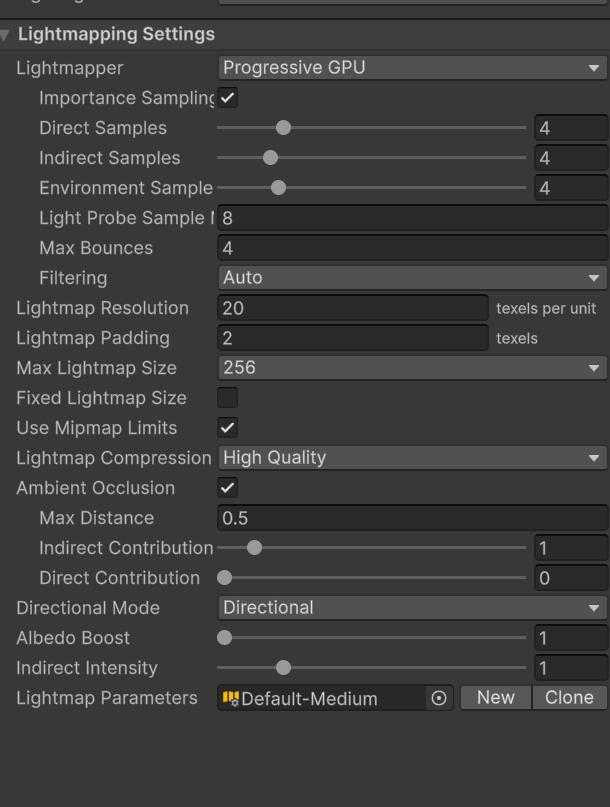

# Руководство пользователя

## Интерфейс программы

Главное окно состоит из нескольких областей:

1. **Панель навигации** – переключение между разделами
2. **Область данных** – таблицы со студентами и оценками
3. **Панель инструментов** – кнопки действий
4. **Строка состояния** – информация о текущем режиме

  
*(поместите скриншот в `docs/images/interface.png`)*

## Работа со студентами

### Добавление студента

1. Перейдите в раздел **«Студенты»**
2. Нажмите кнопку **«Добавить»** (или `Ctrl+N`)
3. Заполните поля формы:
   - Фамилия, имя, отчество
   - Дата рождения
   - Группа
   - Номер зачётной книжки
4. Нажмите **«Сохранить»**

```python
# Пример добавления через API
import requests
data = {
    "last_name": "Иванов",
    "first_name": "Иван",
    "group": "АПИб-22",
    "student_id": "2024001"
}
response = requests.post("http://localhost:8080/api/students", json=data)
print(response.json())